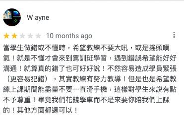

- __這是我在大四下考駕照的紀錄，僅以此獻給我偉大的駕訓班 裏鍵張 教練。__ （在此就不要拿真的名字來用，人家也是要靠這行吃飯的）
---
我是去一間在鳳山附近，叫做新永的駕訓班。因為湊團報，所以也沒有看評價，（ google map 上面的評價有多精彩晚點再說，那又是另一個故事）就跟同學找一找直接無腦衝。想不到，精彩的地獄生活就這樣開始... 

## 「我很重視基本功」
第一天我比約定的時間（06:40 am）還要早了 10 幾分鐘到，我對他印象不錯。他比我早就到練習場了。他每次都非常早到練習場，之前同學也說要早點到，這樣就可以多開幾分鐘的車。  

「我很重視基本功，所以一開始你就先練習轉方向盤。」  

我那天真的就只有聽他長篇大論，和坐在一台沒辦法動的練習車上面轉方向盤。
- 後來聽說好像是因為那天駕訓班沒有車可以讓我開，我不太確定。  

他覺得轉方向盤非常的重要，如果沒有左手跟右手分別放在九點跟三點鐘的位置，那就會很嚴重。於是我的第一天就真的只有練轉方向盤，直到下課前 10 分鐘就叫我離開教具車，去駕訓班的櫃檯電腦練習筆試題目。接下來的每次駕訓班課程也都會像這樣被他偷 10 分鐘以上。第一天就在這種疑惑中結束。結束之後去吃早餐跟同學交換心得，其他人在練習前進後退，我只有轉方向盤的心得可以討論，真是謝囉ㄏㄏ

## 「你覺得原因是什麼」
第二節課開始，我還是提早 10 幾分鐘到場。我想說昨天血虧，連油門都沒有摸到，今天要給他開回來。教練也很不負我望，教我念一次各種檢查的口訣，認得車子編號（駕訓場內每台車有個比車牌還大的編號牌，方便從側面辨識。）之後就上車。  
  
可是我坐後座...

### 碎碎念又要開始了
「你看，看仔細，我現在是不是把方向盤放開讓他回到原位了？」
> 是  

「仔細看喔」 （接著就緩慢地往前開一段，車子偏掉了）  
「你看車子是不是歪掉了？」
> 是  

「你覺得原因是什麼？」
> 因為方向盤有誤差嗎？  

「不是，給你兩個提示：1. 下雨 2. 積水」
> ...  （沒有答案於是沈默）

我開始不知道他到底在幹嘛了，原來駕訓班一萬多塊的課程還包含益智遊戲環節。

「你需要一點想像力啊。我就說你們現在的學生齁，只知道滑手機，都不會觀察生活周遭的環境。你覺得為什麼會積水？」  
> 因為路面的高度不同？  

「不是啦！你真的很沒有邏輯內，都給你這麼多線索還猜不到，」

我這輩子好像也沒有幾次被嗆過沒有邏輯，害我隱隱不爽之餘也好奇他到底能吐出什麼好答案來。  

「就是因為路不平嘛！」  

> ... （這到底跟我剛剛說的有什麼不一樣？氣到不知道要回什麼了）

所以我剛剛到現在就這樣聽你講有的沒的聽 10 幾分鐘，就為了學您的邏輯推理嗎？我決定之後要用最簡短的回答快速跳過這個廢話劇情，不然我今天又是來聽演講的，真的是在哭  

「你們要多讀點書啦！你看教練就是讀很多書(以下省略ㄧ分鐘碎念)......」（他在講這句的時候一直用一種非常嘲諷地快速搖頭 + 嘆氣。這個行為非常的令人煩躁，往後也會不斷出現，如果 google map 評分有激怒學員這項我一定給他滿分）  

後來翻了一下 [google map 評論](https://goo.gl/maps/PhQ3v81NeEqU2qQE8)，還發現真的也有其他人被他的快速搖頭羞辱XD  

後來又聽他介紹了一下要用車子的哪個部位對齊路面，我想每個教練應該都大同小異，就跳過不寫。最後我只「順利」的開了前進後退兩三趟，就被教練指示開去停車了呢！真棒，我停車還賺到一個轉彎，今天收穫真豐碩。開車一點都不重要，能夠聽到要我讀書以及邏輯很差的建議才是對我人生最有幫助的呢！
