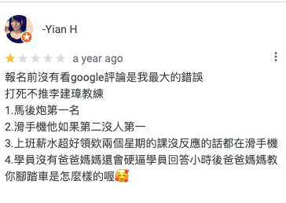

## 全場滑手機
滑手機也是他的個人特色。我覺得應該可以這麼說，「在整個駕訓班課程內，他的手機跟他的嘴巴至少有一個東西會打開。當然，兩個都打開的情形也是不在少數。」當他講完前進後退之後，我們兩個剛換完座位就看到他開始滑手機。有時候他會盯著螢幕突然冒出一句：「油門/煞車不要踩那麼大力！」或者是「煞車不要踩那麼快！」等等警告，會不會其實他滑 line 只是偽裝，其實他的目的是在偷偷觀察我🤨？  

~~後來他在群組傳的各種通知訊息文法狗屁不通、句讀亂用。我只能從分開的詞彙推敲文意，這也更使我相信上述的推測。~~
## 家人怎麼教你騎腳踏車
我忘記他是為了教什麼才會舉這個問題當作例子問我們，但我印象中這不是個精闢的比喻，只是個可有可無的例子。我本來覺得這個問題也沒什麼荒謬的點，只是課堂加入一些無謂的問答會使練習時間縮短，因此不喜歡他迂迴曲折的講解。不過這則 [google map 評論](https://goo.gl/maps/ZGY12va56FXevR3CA)使我笑出來，所以還是把它記錄在這篇文。  

## 物極必反相對論
「物極必反相對論！」  

這句格言在整個駕訓班課程不斷從他的口中聽到。它在我的印象中實在太有記憶點了。因為根據我的理解，物極必反是個四個字的成語，大概是在講中庸之道比較好，太過頭也容易產生反效果或者失敗等等......的意思。至於相對論則是物理學上某個用來描述光速跟時間有關的理論。

我大概有十天左右一直聽到這個詞彙卻不知其所以然，但本著節省時間練習開車的中心思想，我是絕對不會開口問的XD 直到有一天，我突然想通：「啊！左轉方向盤之後不就是要往右轉回來嗎？他該不會說的就是這個吧？」回想情境印證一下果然沒錯，是這個意思。頓時有點開心自己終於聽懂他到底在講什麼鬼，但同時也擔心自己是不是語言能力壞死所以終於可以理解這句話的「深意」。~~順便跟自己約定之後要盡量避免跟他溝通以降低自己上課時的血壓。~~ 我只想問到底怎麼有人可以把中文講成這樣？為什麼不要就直接講方向盤就好啊啊啊啊啊（崩潰

## 你覺得我的時薪有多少
「你知道為什麼教練都沒有年輕人嗎？」  
「因為駕訓班教練薪水太少了。你覺得我的時薪有多少？」  

我認真地估了一下，整個練習課程每天一小時 ~~（扣掉被他叫去電腦刷題偷時間）~~ ，持續一個月，平日上課假日放假。整個課程教練會有一半時間會在車上，後半課程會是一個小時都自己練習，~~沒有噪音的歡樂練車時光~~ 可以快速累積控車的經驗。

> 應該是每小時四百吧？

「四百你給我啊（伸手）」

後來聽他講，好像一個小時才一百多。我是不太相信啦，因為感覺教練有下場工作，應該可以拿更多才對？駕訓班除了油錢、車子保養跟講課的宣導費用（數十人分攤一位講者），還會需要其他支出嗎？

## 心得（對於想考駕照的人真正有用的部分XD）
1. 在駕訓班要想辦法讓教練趕快講完自己開，廢話十句不如自己開錯學到一個經驗，
2. 一開始教練好像會為了衝駕訓班的通過率，拼命恐嚇＋威逼利誘我，想讓我改考自排(手排比自排還要容易熄火)。所以我一開始很挫，很想拼命爭取自己練習的時間來降低手排熄火的機率。
3. 我以為同一個駕訓班的教法都會一樣。想不到李教練教我開 S 型的開法，被驗收的另一位教練（好像規定指導教練跟駕照驗收教練不能相同）說很容易出錯，一直叫我方向盤要轉多一點怎麼樣的XD 反正就以當下坐在車上的教練為主，他們心情好考試就容易過～
4. 其實手排練習時間是夠的，想考手排的人不用理教練的威逼利誘，衝就對了。我到最後練得差不多了，還剩下幾堂課的練習時間被我拿來亂玩 S 型，挑戰高速進去出來，最高紀錄手排車進去出來才花 55 秒，不能熄火有夠刺激www

## 後記
- 好啦，李教練其實也不全都是缺點，也是要看看人家的優點。我覺得他很準時，而且跟他請假他會願意讓我在別的時段補課。沒了。
- 這間駕訓班好像其他教練也有在 google map 上被罵，但是我的李教練應該就是籤王了。但即使是籤王也是有人給他 [google map 好評](https://goo.gl/maps/p7DTTfTXDgG4A781A)，去之前可以先看他被罵的部分自己能不能接受。當然也有遇到人家的教練對我很親切的～算是要挑教練的駕訓班，不知道其他間如何。  

- 一起去的同學教了我一招：「我到後面已經不想理他，他不管說什麼我都說好。結果後來他罵我：『你車子開那麼左邊，旁邊是要再停一輛摩托車嗎？』我也回他：『好。』從那次之後他就閉嘴了」
